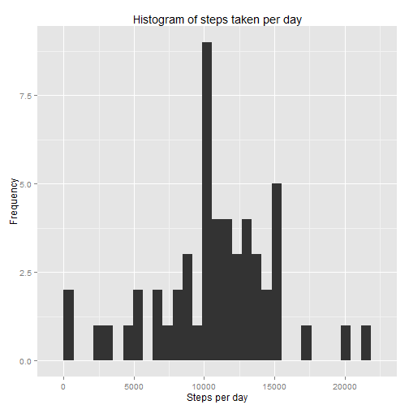
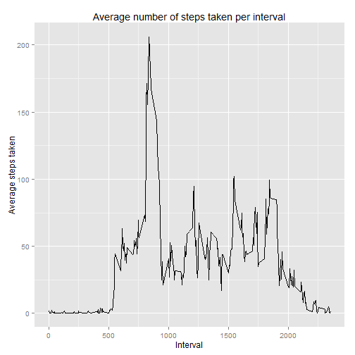
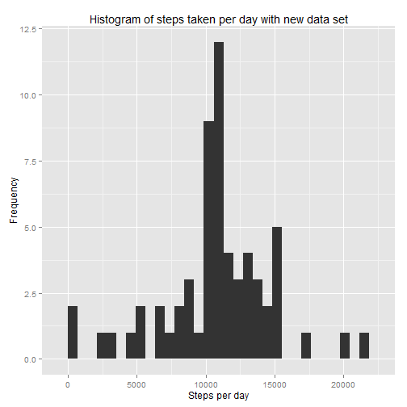
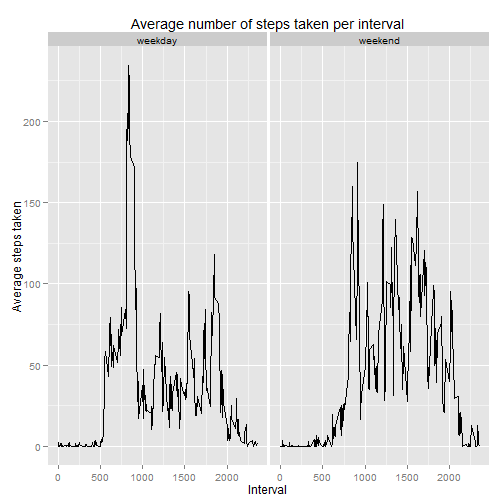

# Peer Assessment 1

## Loading the preprocessing the data

firsly, download the data. Then unzip it and copy to the work direction. Load the data.


```r
data <- read.csv(file="activity.csv",colClasses=c("integer", "Date", "integer"))
```


## What is the mean total number of steps taken per day?

claculate the mean total number of steps taken per day.


```r
stepsPerDay <- aggregate(steps~date, data=data, sum, na.rm=TRUE)
```

create a histagram with the ggplot2 pachage.


```r
library(ggplot2)
qplot(x=steps,
      data=stepsPerDay,
      main="Histogram of steps taken per day",
      xlab="Steps per day",
      ylab="Frequency")
```

```
## stat_bin: binwidth defaulted to range/30. Use 'binwidth = x' to adjust this.
```

 

calculate the  **mean** number of steps per day and the **median** number of
steps per day.


```r
mean(stepsPerDay$steps) 
```

```
## [1] 10766.19
```

```r
median(stepsPerDay$steps)
```

```
## [1] 10765
```

## What is the average daily activity pattern? ##

make a time series plot of the 5-minute interval and the
average number of steps taken, averaged across all days.


```r
library(ggplot2)
meanStepsPerInterval <- aggregate(steps~interval, data=data, mean, na.rm=TRUE)
ggplot(meanStepsPerInterval, aes(x=interval, y=steps)) +
    geom_line() +
    ggtitle("Average number of steps taken per interval") +
    xlab("Interval") +
    ylab("Average steps taken")
```

 

call the code to find out that the five-minute interval start at **835** contains the maximum number of steps which is **206.1698**


```r
meanStepsPerInterval[which.max(meanStepsPerInterval$steps),]
```

```
##     interval    steps
## 104      835 206.1698
```

## Imputing missing values ##

Calculate the total number of missing values is **2304** by calling this code.

```r
sum(is.na(data$steps))
```

```
## [1] 2304
```

create a new dataset equal to the original dataset.replace all NA values the mean number of steps per
corresponding interval.


```r
newdata<-data
getMeanSteps <- function(interval) {
    meanStepsPerInterval[which(meanStepsPerInterval$interval==interval),]$steps
}
for (i in 1:length(newdata$steps)) {
    if (is.na(newdata$steps[i])) newdata$steps[i]<-getMeanSteps(newdata$interval[i])
}
```

check that we have successfully removed the NA values in newdata$steps


```r
any(is.na(data$steps))
```

```
## [1] TRUE
```

Make a histogram of the total number of steps taken each day and Calculate and report the mean and median total number of steps taken per day.Because we use the mean number of steps per to replace NA.There is no difference of total number of steps taken per day between original data and new data.The median changed because the first day is totally missing value, if we replace the NA with our strategy, the steps of the first day is the mean of all the days. The frequency of each step value is higher but the figure is similar.


```r
library(ggplot2)
newstepsPerDay <- aggregate(steps~date, data=newdata, sum, na.rm=TRUE)
qplot(x=steps,
      data=newstepsPerDay,
      main="Histogram of steps taken per day with new data set",
      xlab="Steps per day",
      ylab="Frequency")
```

```
## stat_bin: binwidth defaulted to range/30. Use 'binwidth = x' to adjust this.
```

 

```r
mean(newstepsPerDay$steps) 
```

```
## [1] 10766.19
```

```r
median(newstepsPerDay$steps)
```

```
## [1] 10766.19
```


## Are there differences in activity patterns between weekdays and weekends? ##

create a new factor variable in the dataset with two levels---"weekday"" and
"weekend".Combine the factor to data.


```r
Sys.setlocale(category = "LC_ALL", locale = "C")
```

```
## [1] "C"
```

```r
weekday <- weekdays(data$date)
type <- ifelse(weekday == "Saturday" | weekday == "Sunday", "weekend", "weekday")
type <- factor(type)
datawithweek<-cbind(data,type)
```

claculate the mean number of steps per 5-minute interval

```r
meanStepsPerIntervalwithWeek<- aggregate(steps~interval+type, data=datawithweek, mean, na.rm=TRUE)
```

We use ggplot1 to make a panel plot containing a time series plot of the
5-minute interval and the average number of steps taken, averaged
across all weekday days or weekend days.


```r
ggplot(meanStepsPerIntervalwithWeek, aes(x=interval, y=steps)) +
   facet_grid(. ~type)+
    geom_line() +
    ggtitle("Average number of steps taken per interval") +
    xlab("Interval") +
    ylab("Average steps taken")
```

 


